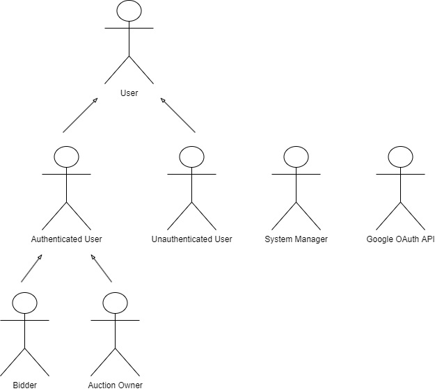
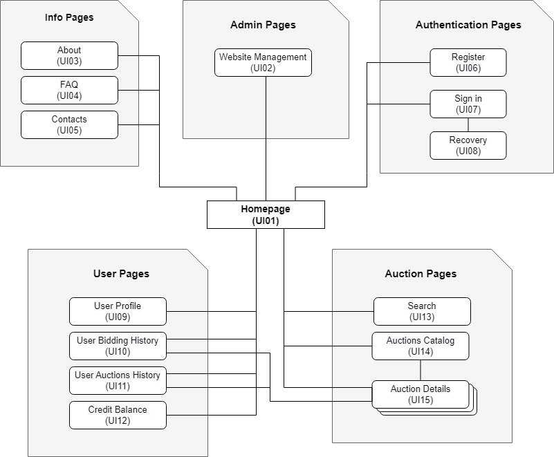

# ER: Requirements Specification Component

## A1: WeBid

&nbsp;&nbsp;&nbsp;&nbsp;Developed by a small group of developers from LBAW 22/23, WeBid is a product that markets to the individual user who wishes to bid on items online. 
&nbsp;&nbsp;&nbsp;&nbsp;The aim of this project is to develop a web application capable of supporting an online auction service. It allows its users not only to bid on existing items but also to be able to place their own items up for auction.
The use of technology is increasing day by day, therefore people are relying more and more on it to accomplish specific tasks in their lives. It would be ideal to have an application that would ease users' lives when trying to either purchase a product or sell one. 
&nbsp;&nbsp;&nbsp;&nbsp;The platform will have an adaptive & intuitive design, independent of the system or capabilities of the user, having products organized throughout different categories, improving the users experience when searching for a more specific product at auction. Also, it will automatically manage the bidding deadline and determine the winning bid. Each product will have assigned its current bid and time left until the auction expires. 
&nbsp;&nbsp;&nbsp;&nbsp;With the purpose of maintaining a trustworthy service, bidders will be able to rate the sellers of the auction they took part in, ensuring reliability for future users. They will also have the possibility to view the bidding history for each auction. 
&nbsp;&nbsp;&nbsp;&nbsp;There will be an instant notification system, keeping track of the auctions so that users don’t miss anything out, such as when there is a new bid or if the action is about to end or actually ended already. 
Users are separated into groups with different permissions: the system managers, the authenticated users and the non authenticated users. Anything a group can do, the previous also can. 
&nbsp;&nbsp;&nbsp;&nbsp;The system managers will be the ones moderating the application, ensuring there are no conflicts. They will have the permissions to manage the auctions, block user accounts and delete inappropriate content. 
&nbsp;&nbsp;&nbsp;&nbsp;The authenticated users can either be bidders or auction owners, having the privileges to bid on auctions as well as create & manage the status of their own ones. By allowing them to manage their auctions, they’re able to set a bid floor, a minimum bid increase, a bid time, and even cancel the auction, which may issue them a penalty. They’re allowed the freedom to edit their personal information in their profile, such as username, email, password, profile picture and, if they wish to, delete the account, with only the bidding registry, list of bought items and past reviews being left in the system. 
&nbsp;&nbsp;&nbsp;&nbsp;The non-authenticated users, on the other hand, won’t have those permissions, only being able to search and browse the different products and auctions either by text input or filters and see bidding users profiles. User registration and login are also available.

---

## A2: Actors and User stories

This artifact expands upon the actors and their user stories with the intent of breaking down the project’s requirements and explaining the interactions between the users and the application.

### 1. Actors

<figure>
  

  <figcaption>
Fig1: WeBid Actors
</figcaption>
</figure>

| Identifier | Description |
| ------ | ------ |
| User | Generic user that has access to public information, such as the current products at auctions. |
| Authenticated User | User that can bid on live auctions, put his own items up for auction and rate other sellers based on his experience. |
| Unauthenticated User | User that can either sign in or register himself. Acts as a visitor. |
| Bidder | An authenticated user that bid on a product at least once. |
| Auction Owner | An authenticated user that put a product up for auction. |
| System Manager | Responsible not only for moderating the application, but also for managing the auctions, blocking user accounts and deleting inappropriate content.|
| Google OAuth API | External OAuth API for Google accounts, that can be used on both sign up and sign in. |

<figure><figcaption>
Table1: WeBid actors description
</figure></figcaption>

### 2. User Stories

For the WeBid app, consider the following user stories presented, bundled and organized by actor.

#### 2.1. User

| Identifier | Name | Priority | Description |
| ------ | ------ | ------ | ------ |
| US01 | View Users Profile | High | As a User, I want to view the other users profile, so that I can see who I am interacting with. |
| US02 | Search Auctions | High | As a User, I want to search auctions, so that I can find the products I’m looking for. |
| US03 | View Active Auctions | High | As a User, I want to view the active auctions, so that I can see if any product interests me. |
| US04 | View Own Profile | High | As a User, I want to view my own profile, so that I know what personal information is being publicly displayed. |
| US05 | View Home Page | High | As a User, I want to access the home page, so that I can see a short exhibition of the website. |
| US06 | View Auction Info | High | As a User, I want to view an auction, so that I can know more information about it. |
| US07 | Browse Auctions by Category | Medium | As a User, I want to browse auctions by category, so that I can find what I am searching for with ease. |
| US08 | Contextual Errors | Medium | As a User, I want to get contextual error messages, so that I can know what I'm doing wrong at a specific moment |
| US09 | Contextual Help | Medium | As a User, I want to get contextual help messages (aka tooltips), so that I can get the information I'm missing to complete a certain task. |
| US010 | View About Us | Medium | As a User, I want to access the about page, so that I can have more information on the website and its developers. |
| US011 | View Contacts | Medium | As a User, I want to access the contact page, so that I can get in touch with the creators. |
| US012 | View FAQ | Medium | As a User, I want to access the FAQ page, so that I can easily find answers for my questions. |
| US013 | Filtered Search | Medium | As a User, I want to add filters to my searches, so that I can pinpoint the exact items I want quicker. |
| US014 | Multiple Attribute Search| Medium | As a User, I want to search for multiple words, so that I can narrow the results of a search. |
| US015 | Input Placeholders | Medium | As a User, I want to see input placeholders, so that I understand what's expected of me when filling in forms. |
| US016 | View Seller Rating | Medium | As a User, I want to view the rating of the seller, so that I can know if he is reliable. |
| US017 | Ordering Results | Low | As a User, I want to order search results, so that I can best attend to my priorities. |
<figure><figcaption>
Table2.1: User user stories
</figure></figcaption>

#### 2.2. Unauthenticated User

| Identifier | Name | Priority | Description |
| ------ | ------ | ------ | ------ |
| US11 | Sign In | High | As an Unauthenticated User, I want to sign in, so that I can access privileged information. |
| US12 | Sign Up | High | As an Unauthenticated User, I want to sign up, so that I can authenticate myself into the system. |
| US13 | Password Recovery | Medium | As an Unauthenticated User, I want to recover my password, so that I can regain access to my account. |
| US14 | Google OAuth API Sign In | Low | As an Unauthenticated User, I want to sign in with my Google account, so that I can login with ease. |
| US15 | Google OAuth API Sign Up | Low | As an Unauthenticated User, I want to sign up with my Google account, so that I don’t have to do the entire registry process. |
<figure><figcaption>
Table2.2: Unauthenticated User user stories
</figure></figcaption>

#### 2.3. Authenticated User

| Identifier | Name | Priority | Description |
| ------ | ------ | ------ | ------ |
| US21 | Sign Out | High | As an Authenticated User, I want to sign out, so that I can close my session. |
| US22 | Edit Profile | High | As an Authenticated User, I want to edit my account, so that I can update my information. |
| US23 | Bid on Auction | High | As an Authenticated User, I want to bid on an auction, so that I acquire the product I desire. |
| US24 | Create Auction | High | As an Authenticated User, I want to create an auction, so that I can sell my product. |
| US25 | View Notifications | Medium | As an Authenticated User, I want to view my notifications, so that I don’t miss anything. |
| US26 | Support Profile Picture | Medium | As an Authenticated User, I want to have support for profile pictures, so that I can show others my appearance. |
| US27 | Follow Auction | Medium | As an Authenticated User, I want to follow an auction, so that I can keep track of the products I want. |
| US28 | View Followed Auctions | Medium | As an Authenticated User, I want to view the actions I followed, so that I can keep track of the progress of the auctions. |
| US29 | View Bidding History | Medium | As an Authenticated User, I want to view my bidding history, so that I can keep track of the money I'm possibly spending. |
| US210 | Add Credit to Account | Medium | As an Authenticated User, I want to add credit to my account, so that I have to balance to bid on the auctions. |
| US211 | Delete Account | Medium | As an Authenticated User, I want to delete my account, so that I no longer have my personal info stored on the servers. |
| US212 | Put a New Bid on Auction | Medium | As an Authenticated User, I want to put a new bid on an auction, so that I have a chance at winning a product I desire. |
| US213 | Confirm Bid Popup | Medium | As an Authenticated User, I want to see a confirmation popup when I try to place a bid, so that I don't make any mistakes. |
| US214 | Report Auction | Low | As an Authenticated User, I want to report an auction, so that it can get removed from the application. |
| US215 | Appeal for Unblock | Low | As an Authenticated User, I want to appeal for an account unblock, so that I can regain access to my account. |
| US216 | Instant Messaging Chat with Auction Owner | Low | As an Authenticated User, I want to have an instant messaging chat service, so that I can ask questions about an item to its owner. |
<figure><figcaption>
Table2.3: Authenticated User user stories
</figure></figcaption>

#### 2.4. Bidder

| Identifier | Name | Priority | Description |
| ------ | ------ | ------ | ------ |
| US31 | View Auction Bidding History | High | As a Bidder, I want to view an auction's bidding history, so that I can keep track of the demand of the product. |
| US32 | Rate Seller | Medium | As a Bidder, I want to rate a seller, so that I can give him and other users my feedback. |
| US33 | Partaking Auction Won Notification | Medium | As a Bidder, I want to get a "Partaking Auction Won" notification, so that I know I won an auction. |
| US34 | Partaking Auction Ending Notification | Medium | As a Bidder, I want to get a "Partaking Auction Ending" notification, so that I know an auction I'm partaking is ending. |
| US35 | Partaking Auction Ended Notification | Medium | As a Bidder, I want to get a "Partaking Auction Ended" notification, so that I know an auction I was partaking has ended. |
| US36 | Partaking Auction Canceled Notification | Medium | As a Bidder, I want to get a "Partaking Auction Canceled" notification, so that I know an auction I was partaking was canceled. |
<figure><figcaption>
Table2.4: Bidder user stories
</figure></figcaption>

#### 2.5. Auction Owner

| Identifier | Name | Priority | Description |
| ------ | ------ | ------ | ------ |
| US41 | View My Auctions | High | As an Auction Owner, I want to view my auctions, so that I know which products I sold and which ones I'm selling. |
| US42 | Edit Auction | High | As an Auction Owner, I want to edit an auction, so that I can update its information and status. |
| US43 | Cancel Auction | High | As an Auction Owner, I want to cancel my auction, so that I don’t have to sell the product anymore. |
| US44 | Manage Auction Status | Medium | As an Auction Owner, I want to manage my auctions status, so that the bidders know when an item has been sold. |
| US46 | Owned Auction Ending Notification | Medium | As an Auction Owner, I want to get a "Owned Auction Ending" Notification, so that I know an auction I own is ending. |
| US47 | Owned Auction Ended Notification | Medium | As an Auction Owner, I want to get a "Owned Auction Ended" Notification, so that I know an item I was selling was sold. |
| US48 | Owned Auction Canceled Notification | Medium | As an Auction Owner, I want to get a "Owned Auction Canceled" Notification, so that I know an auction I owned was canceled. |
<figure><figcaption>
Table2.5: Auction Owner user stories
</figure></figcaption>

#### 2.6. System Manager

| Identifier | Name | Priority | Description |
| ------ | ------ | ------ | ------ |
| US51 | Manage Accounts | High | As a System Manager, I want to manage the various user accounts, so that I can search, view, edit, create, etc, them. |
| US52 | Block and Unblock Accounts | Medium | As a System Manager, I want to block / unblock the accounts, so that I can keep a good environment on the app. |
| US53 | Delete User Accounts | Medium | As a System Manager, I want to delete a user account, so that they no longer have access to the website's authenticated features. |
| US54 | Manage Auctions | Medium | As a System Manager, I want to manage an auction, so that I make sure everything is working properly. |
| US55 | Cancel Auctions | Medium | As a System Manager, I want to cancel an auction, so that I can get rid of rule breaking items. |
| US56 | Manage Auction Reports | Low | As a System Manager, I want to manage auction reports, so that I can investigate the complaints users have. |
| US57 | Manage Auction Categories | Low | As a System Manager, I want to manage auction categories, so that I can give users a better search experience. |
| US58 | User Search | Low | As a System Manager, I want to search for users, so that I can quickly find them. |
| US59 | See Blocked User List | Low | As a System Manager, I want to see the list of blocked users, so that I can easily manage them. |
| US510 | See Deleted Auction List | Low | As a System Manager, I want to see the list of auctions , so that I can keep track of them. |
| US511 | See Active Reports | Low | As a System Manager, I want to see the active reports, so that I can attend to them. |
| US512 | See Closed Reports | Low | As a System Manager, I want to see the closed reports, so that I can know which issues were solved. |
| US513 | Change Report Status | Low | As a System Manager, I want to change a report's status, so that I know if it's been dealt with or needs further solving. |
<figure><figcaption>
Table2.6: System Manager user stories
</figure></figcaption>

### 3. Supplementary Requirements

The following section will lay out the business rules, technical requirements, and restrictions of the WeBid product

#### 3.1. Business rules

| Identifier | Name | Description |
| ------ | ------ | ------ |
| BR01 | Owner Bidding | The Owner of a certain item cannot place a bid on that item. |
| BR02 | Deleted Account Info | After an account is deleted, only the user id, username, bidding history and auction history can be stored. All other information regarding a user must be deleted. |
| BR03 | User Bidding | A Bidder should not be allowed to cancel a bid he made. |
| BR04 | End of Auction | After the end of an auction, both parties should close the deal. If it doesn't happen the users are liable and can be suspended. |
| BR05 | Self Review | A User can’t make a review on himself. |
| BR06 | Valid Auction Dates | The date of the end of an auction can’t be prior to the date of the start of it. |
<figure><figcaption>
Table3.1: WeBid Business rules
</figure></figcaption>

#### 3.2. Technical requirements

| Identifier | Name | Description |
| ------ | ------ | ------ |
| TR01 | Availability | The system must be up and running 24/7 |
| TR02 | Accessibility | The system must guarantee that everyone is capable of navigating throughout the whole website, despite their capabilities. |
| TR03 | Usability | The system should be simple and intuitive, so that everyone can take advantage of all the features of the website with easy |
| **TR04** | **Performance** | **The system’s response time should be less than 2s to ensure a good user experience.  With a delay greater than 2 seconds, user experience starts to degrade, specially in a website like WeBid, were some operations are time critical, like placing bids and closing auctions. For that reason, we ought to ensure minimal response times between the users and the server.** |
| **TR05** | **Web application** | **The system is to be implemented as a web application with dynamic pages, using standard HTML, CSS, Javascript and PHP.    Access to the website should be possible from a standard web browser, since we have multiple users, who, more than certainly, don't use the same device or browser.** |
| TR06 | Portability | The system should be working correctly despite the different Operating Systems. |
| TR07 | Database | The database of the web application must be running a PostgreSQL DBS of version 11 and above. |
| **TR08** | **Security** | **The system must protect all the sensitive user information from unauthorized access through the use of an authentication system and attack prevention and protection methods.    User privacy and security are two big concerns in this day and age. Data breaches are always bound to happen, since no system is bullet proof, but our objective is to mitigate them as much as possible.** |
| TR09 | Robustness | The system must be able to deal with any complication or error that might happen. |
| TR10 | Scalability | The system must be able to deal with the growth of users and their actions. |
| TR11 | Ethics | The system must respect all the ethical principles regarding data sharing and collection. |
<figure><figcaption>
Table3.2: WeBid Technical requirements
</figure></figcaption>

#### 3.3. Restrictions

| Identifier | Name | Description |
| ------ | ------ | ------ |
| C01 | Deadline | The WeBid Web App must be ready to use up until the end of the semester. |
<figure><figcaption>
Table3.3: WeBid Restrictions
</figure></figcaption>

---

## A3: Information Architecture

The goal of this artifact is to give a brief insight on the way information is presented on the system. This will be achieved through the use of a Sitemap and a couple Wireframes of the main pages.

### 1. Sitemap

Diagram representation of the flow and hierarchy between pages. It's divided into five different areas, which are:
- **Info Pages**: Pages with general information relevant to the users.
- **Admin Pages**: Pages for website management.
- **Authentication Pages**: Pages for account authentication and recovery.
- **User Pages**: Pages that display users information.
- **Auction Pages**: Pages dedicated to searching for auctions, displaying their information and bidding.  

<figure>
  

  <figcaption>
Fig2: WeBid Sitemap
</figcaption>
</figure>

### 2. Wireframes

The following wireframes are an attempt at demonstrating what two of the main pages will look like: the home page and a generic auction page.

#### UI01: Homepage

<figure>
  

  <figcaption>
Fig3: WeBid Homepage
</figcaption>
</figure>

1. The different categories the user can use to find the right type of products he is looking for. 
2. The search bar, that helps the user find a more specific product

#### UI15: Auction Details

<figure>
  

  <figcaption>
Fig4: WeBid Auction Details
</figcaption>
</figure>

3. The bidding history for a specific auction
4. Breadcrumbs navigation allows the user to quickly navigate and know which pages he's been on

---

## Revision history

Changes made to the first submission:
1. Added editor tag
2. Minor spelling fix

***
GROUP2225, 02/10/2022

* Diogo Babo, [up202004950@edu.fe.up.pt](mailto:up202004950@edu.fe.up.pt)
* João Oliveira, [up202004407@edu.fe.up.pt](mailto:up202004407@edu.fe.up.pt)
* Gustavo Costa, [up202004187@edu.fe.up.pt](mailto:up202004187@edu.fe.up.pt) (editor)
* Ricardo Cavalheiro, [up202005103@edu.fe.up.pt](mailto:up202005103@edu.fe.up.pt)
